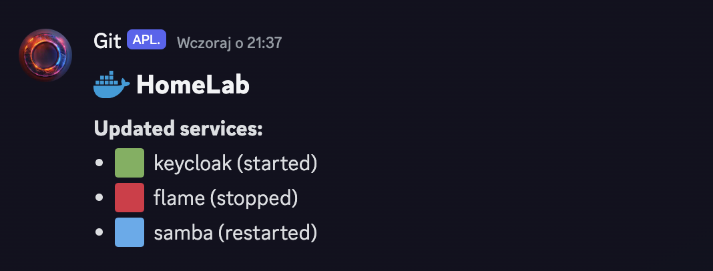

# composed.sh

Simplest "GitOps" for Docker Compose. This script automates the process of updating and deploying services using Docker Compose. It pulls the latest changes from a Git repository, checks for updates in `docker-compose.yml` or `docker-compose.yaml` files, and restarts the affected services. Additionally, it sends notifications to a Discord channel if configured.

## Prerequisites

- Docker and Docker Compose installed.
- Git installed.
- Optional: Discord webhook URL for notifications.

## Configuration

Edit the script and configure the following variables:

- `DEPLOYMENT_ENV`: Description of the deployment environment (used in Discord messages).
- `DEPLOYMENTS_DIR`: Directory containing Docker Compose files.
- `DISCORD_WEBHOOK_URL`: Discord Webhook URL (leave empty if you don't want to use it).

## Directory Structure

Ensure the `DEPLOYMENTS_DIR` is set up with the proper file structure. Each service should have its own directory containing the `docker-compose.yml` or `docker-compose.yaml` file.

Example structure:
```
/deployments
  ├── composed.sh
  └── services
      ├── service1
      │   └── docker-compose.yml
      ├── service2
      │   └── docker-compose.yaml
      └── service3
          └── docker-compose.yml
```

## Git Repository Setup

The `/deployments` directory should be a Git repository. This repository contains the Docker Compose files for each service. **Each service needs its own folder for the script to work properly (as shown in the example above).** To work with the script properly, initialize a Git repository in this directory and commit your changes.

Example workflow:
1. Initialize the Git repository:
   ```bash
   mkdir /deployments
   cd /deployments
   git init
   ```
2. Add your remote repository:
   ```bash
   git remote add origin <repository-url>
   ```
3. Place the script in the `/deployments` directory ([scripts/composed.sh](scripts/composed.sh)):
   ```bash
   cp /path/to/composed.sh /deployments/
   ```
4. Make the script executable:
   ```bash
   chmod +x /deployments/composed.sh
   ```
5. Commit these changes and push them to your repository:
   ```bash
   git add .
   git commit -m "Initial commit with deployment script"
   git push -u origin main
   ```
6. Set up crontab for execution (instructions below).
7. When you set up your first service in your remote repository (e.g., on another computer or GitHub), commit and push your changes. You will see the results in the logs on your server and possibly on your Discord.
8. Enjoy!



## Setting Up Crontab

To automate the execution of the script every 15 seconds and redirect the output to log files:

1. Open the crontab editor:
   ```bash
   crontab -e
   ```
2. Add the following lines to schedule the script every 15 seconds (ugly but works):
   ```bash
   * * * * * /deployments/composed.sh >> /var/log/composed.log 2>&1
   * * * * * sleep 15; /deployments/composed.sh >> /var/log/composed.log 2>&1
   * * * * * sleep 30; /deployments/composed.sh >> /var/log/composed.log 2>&1
   * * * * * sleep 45; /deployments/composed.sh >> /var/log/composed.log 2>&1
   ```
   This configuration ensures the script runs every 15 seconds.

3. Save and exit the editor.

## Logging

The script logs its activity with timestamps. Logs can be found in the specified log file (e.g., `/var/log/composed.log`).

## Disable Service Rule

To disable the deployment of a specific service, add `#disabled` as the first line in its `docker-compose.yml` or `docker-compose.yaml` file. The script will check for this comment and skip the deployment of services marked as disabled, ensuring they remain stopped.

Example:
```yaml
#disabled
version: '3'
services:
  web:
    image: nginx
    ports:
      - "80:80"
```

When the script encounters this comment, it will log that the service is disabled, pull its images, stop the service, and not attempt to restart it. To enable the service again, simply remove the `#disabled` line from the `docker-compose.yml` or `docker-compose.yaml` file.

## Discord Notifications

To enable Discord notifications, set the `DISCORD_WEBHOOK_URL` variable in the script with your Discord webhook URL. Notifications will include the deployment environment and the status of updated services.

## License

This script is provided "as is" without any warranty. Use at your own risk.

---

Feel free to modify and extend this script according to your needs. Contributions and improvements are welcome!